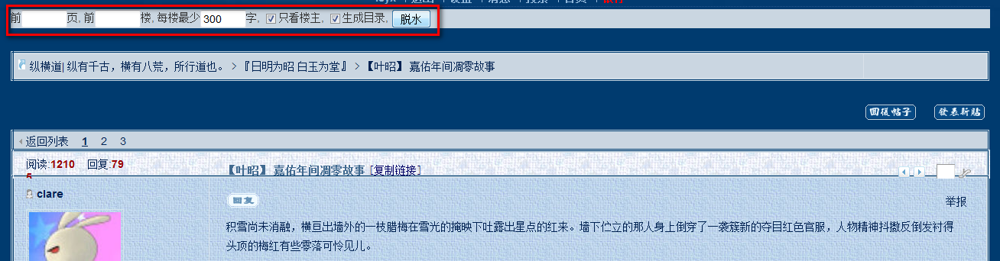

zhd_dewater
===================

纵横道( http://www.zonghengdao.net ) 贴子脱水

安装：http://userscripts.org/scripts/show/183860

结合 [Save Back to File from DOM](https://addons.mozilla.org/zh-CN/firefox/addon/save-back-to-file-from-dom/?src=api) 扩展就可以保存脱水后的贴子到本地

以 clare [【叶昭】 嘉佑年间凋零故事](http://www.zonghengdao.net/read.php?tid=20984) 为例

贴子内添加脱水按钮

脱水后的贴子

